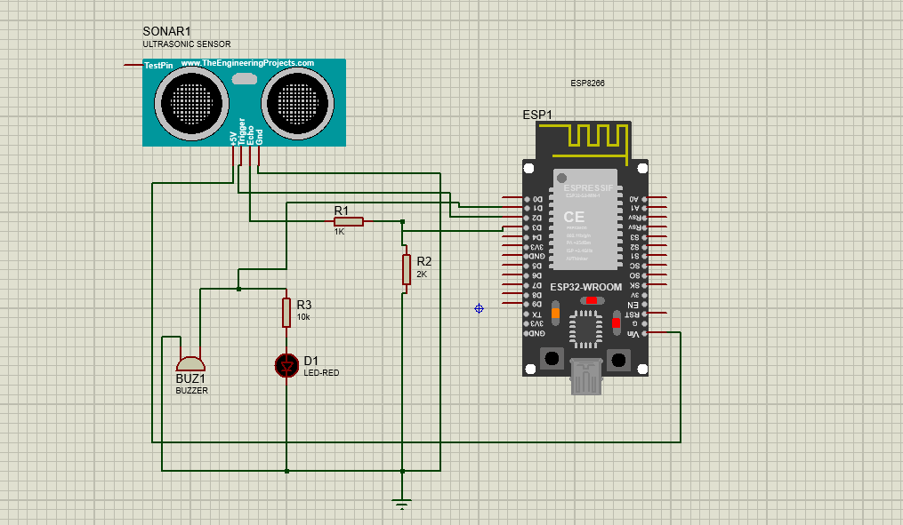

# ESP8266 Smart Obstacle Detection & Alert System

## 📌 Overview
This project is an IoT-based Smart Obstacle Detection and Alert System built using ESP8266 and an ultrasonic sensor. The system detects nearby obstacles in real time and sends instant Telegram alerts whenever an obstacle is detected.

The project can be used for smart vehicle safety systems, parking assistance, and basic security applications.

---

## 🚀 Features
- Real-time obstacle detection using ultrasonic sensor
- Instant Telegram alert notification
- LED/Buzzer alert indication
- WiFi-enabled monitoring using ESP8266
- Spam prevention logic for alerts

---

## 🧠 Working Principle
The ultrasonic sensor continuously measures the distance of nearby objects.

- If the measured distance is less than or equal to the threshold distance:
  - Obstacle detected
  - LED/Buzzer turns ON
  - Telegram alert message is sent

- If the object moves away:
  - System returns to SAFE state
  - SAFE notification is sent

---

## 🛠️ Components Used
- ESP8266 (NodeMCU)
- HC-SR04 Ultrasonic Sensor
- LED / Buzzer
- Resistors
- Jumper Wires
- Breadboard

---

## 🔌 Circuit Connections

| Ultrasonic Sensor | ESP8266 |
|------------------|----------|
| VCC | 3.3V |
| GND | GND |
| TRIG | D2 |
| ECHO | D3 |
| LED/Buzzer | D1 |

---
## 🔌 Circuit Diagram

---
## 📲 Telegram Alert System
The ESP8266 connects to the Telegram Bot API using HTTPS requests.

Alert message includes:
- Obstacle status
- Distance value

Example:
```text
🚨 Obstacle Detected!
Distance: 8.5 cm
Status: 1
```
---
## 🎥 Demo Video
[▶️ Watch Demo Video](https://youtu.be/NKbODyjYWOo)

## 📂 Code
Arduino code is included in this repository. Open Obstacle_alert_on_telegram_ESP8266.ino file
